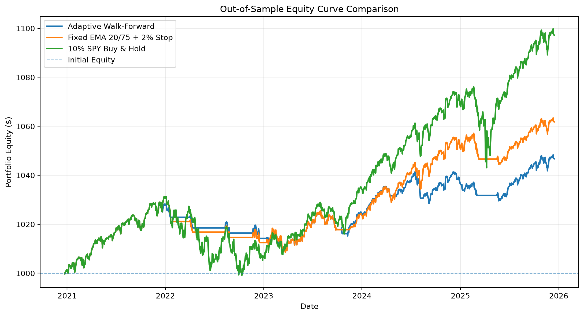
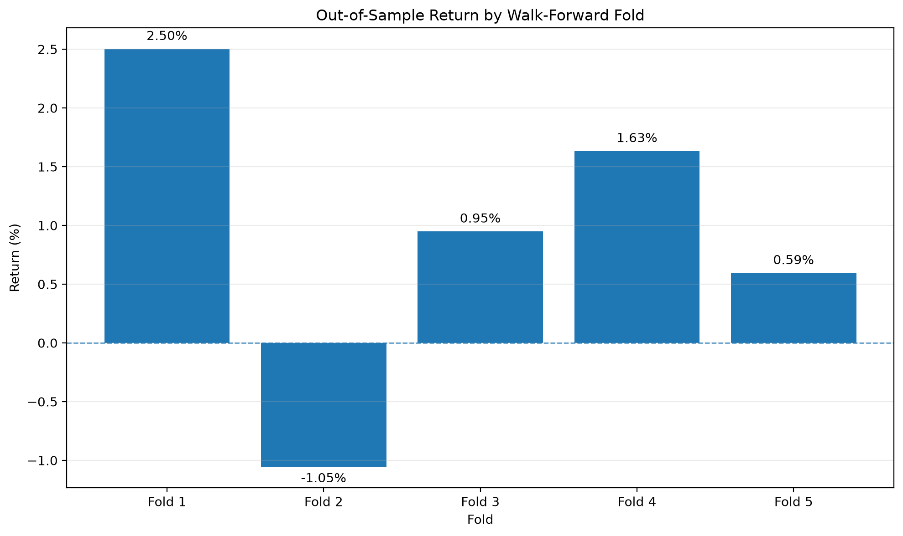

# SPY EMA Trend-Following Research


[](https://github.com/IamGroot56/spy-ema-trading-research/actions/workflows/tests.yml)


A systematic trading research project that evaluates an EMA-based market-timing strategy on SPY using risk-based position sizing, realistic trading costs, chronological validation, and walk-forward testing.

The main research question was:

> **Can an EMA-based market-timing strategy improve risk-adjusted performance relative to an approximately equal-exposure SPY buy-and-hold benchmark?**

The answer in V1 was **no**. EMA timing reduced drawdown, but the lower market exposure cost too much return. The passive benchmark performed better on both total return and Return/MDD over the primary out-of-sample period.

---

## Results at a Glance

Primary out-of-sample period: **December 23, 2020 – December 15, 2025**

| Strategy | OOS Return | CAGR | Max Drawdown | Return / MDD | Trades |
|---|---:|---:|---:|---:|---:|
| Adaptive Walk-Forward | 4.67% | 0.92% | **1.92%** | 2.43 | 21 |
| Fixed EMA 20/75 + 2% Stop | 6.18% | 1.21% | 2.21% | 2.80 | 11 |
| 10% SPY Buy & Hold | **9.72%** | **1.88%** | 3.12% | **3.11** | 1 |

### Main findings

- **EMA timing reduced drawdown, but not enough to beat the passive benchmark on a return-to-drawdown basis.**
- **The fixed 20/75/2 configuration outperformed adaptive walk-forward re-optimization.**
- **Long + Cash performed better than Long + Short under the tested assumptions.**



---

## Strategy

The strategy uses a fast and slow exponential moving average calculated from daily closing prices.

```text
Fast EMA > Slow EMA
AND Price > Fast EMA
→ LONG

Fast EMA < Slow EMA
AND Price < Fast EMA
→ SHORT

Otherwise
→ HOLD
```

The original strategy supported both long and short positions. Testing showed that short exposure weakened performance on SPY, so the primary research version used **Long + Cash**:

```text
Bullish signal
→ LONG

Bearish signal
→ EXIT existing position
→ remain in CASH
```

### Long + Short vs Long + Cash

Using the same EMA 20/50 configuration and trading assumptions:

| Strategy | Return | Max Drawdown | Trades | Win Rate | Profit Factor |
|---|---:|---:|---:|---:|---:|
| Long + Short | 3.70% | 5.07% | 36 | 33.33% | 1.41 |
| Long + Cash | **8.72%** | **3.17%** | 18 | **50.00%** | **3.57** |

Under this setup, staying in cash during bearish signals worked better than opening short positions.

---

## Risk Management

Primary research configuration:

```text
Initial Equity:              $1,000
Risk Per Trade:               0.50%
Maximum Position Notional:   10.00%
Minimum Equity:             $900.00
Transaction Fee:              5 bps
Slippage:                     2 bps
```

Position size is limited by both stop-loss risk and maximum notional exposure.

For example, with $1,000 equity, 0.50% risk per trade, and a 5% stop:

```text
Risk budget = $1,000 × 0.50% = $5
Risk-based position notional ≈ $5 / 5% = $100
```

The backtester uses the smaller of:

```text
Risk-based position size
vs
Maximum position-notional limit
```

A separate experiment showed that increasing risk per trade from 0.25% to 0.50% roughly doubled both return and drawdown without materially changing win rate or profit factor. Higher position size increased exposure, not strategy quality.

---

## Backtesting Methodology

Historical SPY daily OHLCV data is downloaded with `yfinance` and validated before use.

Research period:

```text
January 2, 2018 – August 5, 2026
```

To avoid same-bar look-ahead assumptions, signals are generated from a completed daily candle and executed at the next trading day's open:

```text
Day T close
→ generate signal

Day T+1 open
→ execute signal
```

The simulator includes:

- Long and short positions
- EXIT and HOLD signals
- Stop losses
- Risk-based position sizing
- Transaction fees
- Adverse slippage
- Trade logging
- Equity-curve generation
- One active position at a time

Trading costs in the main experiments were **5 bps fees** and **2 bps adverse slippage**.

---

## Parameter Search and Validation

The parameter sweep evaluated:

```text
Fast EMA:  5, 10, 20, 30
Slow EMA:  40, 50, 75, 100, 150, 200
Stop Loss: 2%, 3%, 5%, 8%, 10%
```

Invalid combinations where `Fast EMA >= Slow EMA` were excluded.

### Initial chronological split

The data was first divided into an earlier training period and a later validation period.

Best training candidate:

```text
Fast EMA:    20
Slow EMA:    75
Stop Loss:   2%
Strategy:    LONG + CASH
```

The initial validation period produced a positive return, but only four trades, so the project moved to walk-forward evaluation instead of relying on a single split.

### Walk-forward evaluation

Configuration:

```text
Training Window:      750 trading days
Validation Window:    250 trading days
Step Size:            250 trading days
Number of Folds:      5
Strategy Mode:        LONG_CASH
```

For each fold:

```text
Train
→ select parameters
→ freeze parameters
→ validate on the next period
→ move forward
```



| Fold | Validation Period | Fast | Slow | Stop | Return |
|---:|---|---:|---:|---:|---:|
| 1 | 2020-12-23 → 2021-12-20 | 20 | 75 | 2% | +2.50% |
| 2 | 2021-12-21 → 2022-12-16 | 20 | 75 | 2% | -1.05% |
| 3 | 2022-12-19 → 2023-12-15 | 5 | 100 | 2% | +0.95% |
| 4 | 2023-12-18 → 2024-12-13 | 5 | 40 | 5% | +1.63% |
| 5 | 2024-12-16 → 2025-12-15 | 30 | 200 | 2% | +0.59% |

The selected parameters changed substantially across later folds. In this experiment, that extra re-optimization did not improve out-of-sample performance relative to the simpler fixed 20/75/2 strategy.

---

## Benchmark

A 100%-invested SPY benchmark would have much higher exposure than the strategy, which caps position notional at approximately 10% of equity.

The comparison benchmark was therefore:

```text
10% SPY
90% Cash
```

This matches **maximum exposure approximately**, not average exposure. The EMA strategy may hold less than 10% because of risk-based sizing and can also remain fully in cash.

Primary OOS benchmark results:

```text
Return:            9.72%
CAGR:              1.88%
Maximum Drawdown:  3.12%
Return / MDD:      3.11
```

The fixed EMA strategy reduced maximum drawdown to 2.21%, but its 6.18% return was too low to beat the passive benchmark on Return/MDD.

---

## Project Structure

```text
spy-ema-trading-research/
│
├── src/
│   ├── backtester.py
│   ├── data_loader.py
│   ├── features.py
│   ├── metrics.py
│   ├── parameter_sweep.py
│   ├── risk_manager.py
│   ├── strategy.py
│   └── walk_forward.py
│
├── scripts/
│   ├── download_stock_data.py
│   ├── run_stock_backtest.py
│   ├── run_stock_parameter_sweep.py
│   ├── run_stock_walk_forward.py
│   └── generate_research_figures.py
│
├── tests/
├── figures/
├── README.md
├── requirements.txt
└── .gitignore
```

Main components are separated by responsibility: data loading, feature generation, signal logic, risk management, backtesting, performance metrics, parameter search, and walk-forward evaluation.

---

## Reproduce the Research

Clone the repository:

```bash
git clone https://github.com/IamGroot56/spy-ema-trading-research.git
cd spy-ema-trading-research
```

Create and activate a virtual environment:

```bash
python -m venv .venv
```

Windows PowerShell:

```powershell
.\.venv\Scripts\Activate.ps1
```

macOS / Linux:

```bash
source .venv/bin/activate
```

Install dependencies:

```bash
python -m pip install -r requirements.txt
```

Run tests:

```bash
python -m pytest -q
```

Run the main research workflow:

```bash
python -m scripts.download_stock_data
python -m scripts.run_stock_backtest
python -m scripts.run_stock_parameter_sweep
python -m scripts.run_stock_walk_forward
python -m scripts.generate_research_figures
```

The market-data CSV is excluded from Git because it can be reproduced using the download script.

---

## Limitations

This is a research backtester, not a production trading system.

Important limitations include:

- Only SPY is evaluated in V1.
- Daily OHLCV data does not reveal the exact intraday price path.
- Stop-loss fills can be worse than modeled during price gaps.
- Short borrow fees were not included in the early Long + Short experiment.
- Cash earns 0% interest in the current model.
- The number of out-of-sample trades is relatively small.
- Parameter results may depend on the selected search space and training-window length.
- V1 does not include a completely untouched final holdout period.
- Historical performance does not imply future profitability.

---

## What I Learned

The main lesson from V1 was that a better-looking backtest is not necessarily a better strategy.

- Increasing position size increased both return and drawdown without improving trade quality.
- Long + Cash worked better than Long + Short on SPY under the tested assumptions.
- Strong in-sample parameter results became much weaker out of sample.
- Adaptive re-optimization added complexity but did not beat the fixed configuration.
- The passive benchmark was essential for judging whether lower drawdown actually translated into better risk-adjusted performance.

### Conclusion

> **The EMA timing system reduced drawdown, but V1 did not demonstrate enough predictive advantage to outperform an approximately equal-exposure SPY buy-and-hold benchmark on a return-to-drawdown basis.**

V1 is frozen to avoid repeatedly tuning the same historical data.

---

## Future Work

A future version should focus on new hypotheses rather than expanding the same EMA parameter grid. The highest-priority improvements are:

- Reserve a completely untouched final holdout period before development.
- Improve gap and stop-loss execution using intraday data.
- Test the same frozen strategy across a predefined set of additional markets.
- Model cash yield and compare strategies using exposure-aware metrics.

---

## Disclaimer

This repository is for software engineering practice, quantitative research, education, and portfolio demonstration. It is not financial advice.

All results are historical simulations and do not represent live trading performance.
